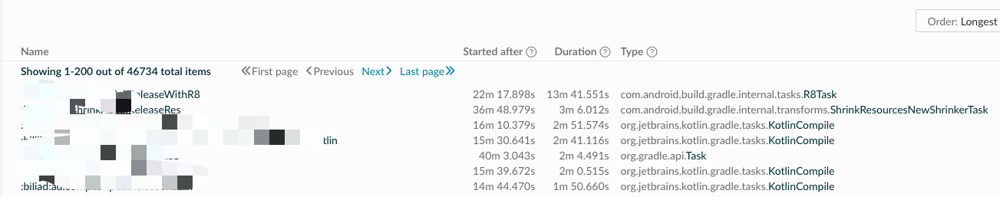
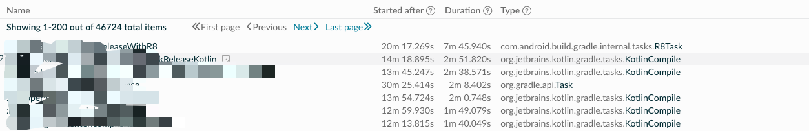

# Android R8 简单优化

---

# 介绍

终于我们全源码编译的 Release 包已经超过了40分钟了，感觉离提桶跑路不远了。

使用 `--scan` 分析了编译过程，发现 `minifyReleaseWithR8` 任务耗时近14分钟。




# 流程分析

从网上搜一下，基本上没有什么卵用，都是一些配置。

从官网捞一点介绍，有一个 `r8 runInSeparateProcess`， 说有一点作用，尝试测试了下。

具体可以参照下 [AGP8](https://developer.android.com/build/releases/past-releases/agp-8-0-0-release-notes?hl=zh-cn)。项目中实验了下，参考如下配置，在 `settings.gradle` 中配置一下，仅在 CI 服务器上生效。

```gradle
// settings.gradle

// r8 编译新特性
if (System.getenv().containsKey("CI_SERVER") && System.getenv("R8_PROFILE") == "1") {
    apply from: "settings-ci-r8.gradle"
}
```


```gradle
// settings-ci-r8.gradle
apply plugin: 'com.android.settings'
android {
    execution {
        profiles {
            dev {
                r8.runInSeparateProcess false
            }
            server {
                r8 {
                    jvmOptions += ["-Xms50g", "-Xmx200g", "-XX:+HeapDumpOnOutOfMemoryError"]
                    runInSeparateProcess true
                }
            }
        }

        // ci
        if (System.getenv().containsKey("CI_SERVER")) {
            defaultProfile "server"
        } else {
            defaultProfile "dev"
        }
    }
}

logger.quiet("android.execution.defaultProfile = ${android.execution.defaultProfile}")
```

最后尝试了下，并没有什么效果，只是 `gradle` 的进程内存占用少了点, GC 时间数据也好点，编译耗时基本没有效果。内存占用少主要是因为 `r8` 任务是单独的进程执行的，所以内存占用会比串行执行要少一点。

翻了翻 `agp` 源码，发现 `r8` 以下逻辑的。

```kotlin
// 该源码有删减，只是为了展示关键逻辑
@CacheableTask
@BuildAnalyzer(primaryTaskCategory = TaskCategory.OPTIMIZATION)
abstract class R8Task @Inject constructor(
    projectLayout: ProjectLayout
): ProguardConfigurableTask(projectLayout) {


    override fun doTaskAction() {
        if (executionOptions.get().runInSeparateProcess) {
            workerExecutor.processIsolation { spec ->
                spec.forkOptions { forkOptions ->
                    forkOptions.jvmArgs(executionOptions.get().jvmArgs)
                }
            }.submit(R8Runnable::class.java, workerAction)
        } else {
            workerExecutor.noIsolation().submit(R8Runnable::class.java, workerAction)
        }
    }

    companion object {
        fun shrink(
            bootClasspath: List<File>,
            minSdkVersion: Int,
            isDebuggable: Boolean,
            enableDesugaring: Boolean,
            disableTreeShaking: Boolean,
            disableMinification: Boolean,
            mainDexListFiles: List<File>,
            mainDexRulesFiles: List<File>,
            mainDexListOutput: File?,
            legacyMultiDexEnabled: Boolean,
            useFullR8: Boolean,
            referencedInputs: List<File>,
            classes: List<File>,
            resourcesJar: File,
            proguardConfigurationFiles: Collection<File>,
            inputProguardMapping: File?,
            proguardConfigurations: MutableList<String>,
            isAar: Boolean,
            mappingFile: File,
            proguardSeedsOutput: File,
            proguardUsageOutput: File,
            proguardConfigurationOutput: File,
            missingKeepRulesOutput: File,
            output: File,
            outputResources: File,
            featureClassJars: List<File>,
            featureJavaResourceJars: List<File>,
            featureDexDir: File?,
            featureJavaResourceOutputDir: File?,
            libConfiguration: String?,
            errorFormatMode: SyncOptions.ErrorFormatMode,
            inputArtProfile: File?,
            outputArtProfile: File?,
            enableDexStartupOptimization: Boolean,
            inputProfileForDexStartupOptimization: File?,
        ) {
           

            // When invoking R8 we filter out missing files. E.g. javac output may not exist if
            // there are no Java sources. See b/151605314 for details.
            runR8(
                filterMissingFiles(classes, logger),
                output.toPath(),
                resourcesJar.toPath(),
                outputResources.toPath(),
                bootClasspath.map { it.toPath() },
                filterMissingFiles(referencedInputs, logger),
                toolConfig,
                proguardConfig,
                mainDexListConfig,
                MessageReceiverImpl(errorFormatMode, Logging.getLogger(R8Runnable::class.java)),
                useFullR8,
                featureClassJars.map { it.toPath() },
                featureJavaResourceJars.map { it.toPath() },
                featureDexDir?.toPath(),
                featureJavaResourceOutputDir?.toPath(),
                libConfiguration,
                inputArtProfile?.toPath(),
                outputArtProfile?.toPath(),
                enableDexStartupOptimization,
                inputProfileForDexStartupOptimization?.toPath(),
            )
        }
    }

    abstract class R8Runnable : WorkAction<R8Runnable.Params> {

        abstract class Params : WorkParameters {
            abstract val bootClasspath: ConfigurableFileCollection
            abstract val minSdkVersion: Property<Int>
            abstract val debuggable: Property<Boolean>
            abstract val disableTreeShaking: Property<Boolean>
            abstract val enableDesugaring: Property<Boolean>
            abstract val disableMinification: Property<Boolean>
            abstract val mainDexListFiles: ConfigurableFileCollection
            abstract val mainDexRulesFiles: ConfigurableFileCollection
            abstract val mainDexListOutput: RegularFileProperty
            abstract val legacyMultiDexEnabled: Property<Boolean>
            abstract val useFullR8: Property<Boolean>
            abstract val referencedInputs: ConfigurableFileCollection
            abstract val classes: ConfigurableFileCollection
            abstract val resourcesJar: RegularFileProperty
            abstract val proguardConfigurationFiles: ConfigurableFileCollection
            abstract val inputProguardMapping: RegularFileProperty
            abstract val proguardConfigurations: ListProperty<String>
            abstract val aar: Property<Boolean>
            abstract val mappingFile: RegularFileProperty
            abstract val proguardSeedsOutput: RegularFileProperty
            abstract val proguardUsageOutput: RegularFileProperty
            abstract val proguardConfigurationOutput: RegularFileProperty
            abstract val missingKeepRulesOutput: RegularFileProperty
            abstract val output: RegularFileProperty
            abstract val outputResources: RegularFileProperty
            abstract val featureClassJars: ConfigurableFileCollection
            abstract val featureJavaResourceJars: ConfigurableFileCollection
            abstract val featureDexDir: DirectoryProperty
            abstract val featureJavaResourceOutputDir: DirectoryProperty
            abstract val libConfiguration: Property<String>
            abstract val errorFormatMode: Property<SyncOptions.ErrorFormatMode>
            abstract val inputArtProfile: RegularFileProperty
            abstract val outputArtProfile: RegularFileProperty
            abstract val enableDexStartupOptimization: Property<Boolean>
            abstract val inputProfileForDexStartupOptimization: RegularFileProperty
        }

        override fun execute() {
            shrink(
                parameters.bootClasspath.files.toList(),
                parameters.minSdkVersion.get(),
                parameters.debuggable.get(),
                parameters.enableDesugaring.get(),
                parameters.disableTreeShaking.get(),
                parameters.disableMinification.get(),
                parameters.mainDexListFiles.files.toList(),
                parameters.mainDexRulesFiles.files.toList(),
                parameters.mainDexListOutput.orNull?.asFile,
                parameters.legacyMultiDexEnabled.get(),
                parameters.useFullR8.get(),
                parameters.referencedInputs.files.toList(),
                parameters.classes.files.toList(),
                parameters.resourcesJar.asFile.get(),
                parameters.proguardConfigurationFiles.files.toList(),
                parameters.inputProguardMapping.orNull?.asFile,
                parameters.proguardConfigurations.get(),
                parameters.aar.get(),
                parameters.mappingFile.get().asFile,
                parameters.proguardSeedsOutput.get().asFile,
                parameters.proguardUsageOutput.get().asFile,
                parameters.proguardConfigurationOutput.get().asFile,
                parameters.missingKeepRulesOutput.get().asFile,
                parameters.output.get().asFile,
                parameters.outputResources.get().asFile,
                parameters.featureClassJars.files.toList(),
                parameters.featureJavaResourceJars.files.toList(),
                parameters.featureDexDir.orNull?.asFile,
                parameters.featureJavaResourceOutputDir.orNull?.asFile,
                parameters.libConfiguration.orNull,
                parameters.errorFormatMode.get(),
                parameters.inputArtProfile.orNull?.asFile,
                parameters.outputArtProfile.orNull?.asFile,
                parameters.enableDexStartupOptimization.get(),
                parameters.inputProfileForDexStartupOptimization.orNull?.asFile,
            )
        }
    }
}
```

通过上述代码，发现 通过参数 `runInSeparateProcess`，然后丢给了 `workerExecutor`，然后执行 `submit` 提交任务，一个是单独的`processIsolation`，一个是直接运行。

```
if (executionOptions.get().runInSeparateProcess) {
    workerExecutor.processIsolation { spec ->
        spec.forkOptions { forkOptions ->
            forkOptions.jvmArgs(executionOptions.get().jvmArgs)
        }
    }.submit(R8Runnable::class.java, workerAction)
} else {
    workerExecutor.noIsolation().submit(R8Runnable::class.java, workerAction)
}
```

不管是直接运行，还是单独的进程运行，最后都是调用`shrink` 方法, 方法中最后执行 `runR8` 方法。捞了一下 `runR8`，在 `r8Tool.kt` 中。

```kotlin
fun runR8(
    inputClasses: Collection<Path>,
    output: Path,
    inputJavaResJar: Path,
    javaResourcesJar: Path,
    libraries: Collection<Path>,
    classpath: Collection<Path>,
    toolConfig: ToolConfig,
    proguardConfig: ProguardConfig,
    mainDexListConfig: MainDexListConfig,
    messageReceiver: MessageReceiver,
    useFullR8: Boolean = false,
    featureClassJars: Collection<Path>,
    featureJavaResourceJars: Collection<Path>,
    featureDexDir: Path?,
    featureJavaResourceOutputDir: Path?,
    libConfiguration: String? = null,
    inputArtProfile: Path? = null,
    outputArtProfile: Path? = null,
    enableMinimalStartupOptimization: Boolean = false,
    inputProfileForDexStartupOptimization: Path? = null,
) {
    val logger: Logger = Logger.getLogger("R8")
    if (logger.isLoggable(Level.FINE)) {
        logger.fine("*** Using R8 to process code ***")
        logger.fine("Main dex list config: $mainDexListConfig")
        logger.fine("Proguard config: $proguardConfig")
        logger.fine("Tool config: $toolConfig")
        logger.fine("Program classes: $inputClasses")
        logger.fine("Java resources: $inputJavaResJar")
        logger.fine("Library classes: $libraries")
        logger.fine("Classpath classes: $classpath")
    }
    val r8CommandBuilder =
        R8Command.builder(
            R8DiagnosticsHandler(
                proguardConfig.proguardOutputFiles.missingKeepRules,
                messageReceiver,
                "R8"
            )
        )

    if (!useFullR8) {
        r8CommandBuilder.setProguardCompatibility(true);
    }

    if (toolConfig.r8OutputType == R8OutputType.DEX) {
        r8CommandBuilder.minApiLevel = toolConfig.minSdkVersion
        if (toolConfig.minSdkVersion < 21) {
            // specify main dex related options only when minSdkVersion is below 21
            r8CommandBuilder
                .addMainDexRulesFiles(mainDexListConfig.mainDexRulesFiles)
                .addMainDexListFiles(mainDexListConfig.mainDexListFiles)

            if (mainDexListConfig.mainDexRules.isNotEmpty()) {
                r8CommandBuilder.addMainDexRules(mainDexListConfig.mainDexRules, Origin.unknown())
            }
            mainDexListConfig.mainDexListOutput?.let {
                r8CommandBuilder.setMainDexListConsumer(StringConsumer.FileConsumer(it))
            }
        }
        if (libConfiguration != null) {
            r8CommandBuilder.addSpecialLibraryConfiguration(libConfiguration)
        }
        if (toolConfig.isDebuggable) {
            r8CommandBuilder.addAssertionsConfiguration(
                AssertionsConfiguration.Builder::compileTimeEnableAllAssertions
            )
        }
    }

    r8CommandBuilder
        .addProguardConfigurationFiles(
            proguardConfig.proguardConfigurationFiles.filter { Files.isRegularFile(it) }
        )
        .addProguardConfiguration(proguardConfig.proguardConfigurations, Origin.unknown())

    if (proguardConfig.proguardMapInput != null
        && Files.exists(proguardConfig.proguardMapInput)
    ) {
        r8CommandBuilder.addProguardConfiguration(
            listOf("-applymapping \"${proguardConfig.proguardMapInput}\""),
            Origin.unknown()
        )
    }

    val proguardOutputFiles = proguardConfig.proguardOutputFiles
    Files.deleteIfExists(proguardOutputFiles.proguardMapOutput)
    Files.deleteIfExists(proguardOutputFiles.proguardSeedsOutput)
    Files.deleteIfExists(proguardOutputFiles.proguardUsageOutput)
    Files.deleteIfExists(proguardOutputFiles.proguardConfigurationOutput)
    Files.deleteIfExists(proguardOutputFiles.missingKeepRules)

    Files.createDirectories(proguardOutputFiles.proguardMapOutput.parent)
    r8CommandBuilder.setProguardMapOutputPath(proguardOutputFiles.proguardMapOutput)
    r8CommandBuilder.setProguardSeedsConsumer(
        StringConsumer.FileConsumer(proguardOutputFiles.proguardSeedsOutput)
    )
    r8CommandBuilder.setProguardUsageConsumer(
        StringConsumer.FileConsumer(proguardOutputFiles.proguardUsageOutput)
    )
    r8CommandBuilder.setProguardConfigurationConsumer(
        StringConsumer.FileConsumer(
            proguardOutputFiles.proguardConfigurationOutput
        )
    )

    val compilationMode =
        if (toolConfig.isDebuggable) CompilationMode.DEBUG else CompilationMode.RELEASE

    val dataResourceConsumer = JavaResourcesConsumer(javaResourcesJar)
    val programConsumer =
        if (toolConfig.r8OutputType == R8OutputType.CLASSES) {
            val baseConsumer: ClassFileConsumer = if (Files.isDirectory(output)) {
                ClassFileConsumer.DirectoryConsumer(output)
            } else {
                ClassFileConsumer.ArchiveConsumer(output)
            }
            object : ClassFileConsumer.ForwardingConsumer(baseConsumer) {
                override fun getDataResourceConsumer(): DataResourceConsumer? {
                    return dataResourceConsumer
                }
            }
        } else {
            val baseConsumer: DexIndexedConsumer = if (Files.isDirectory(output)) {
                DexIndexedConsumer.DirectoryConsumer(output)
            } else {
                DexIndexedConsumer.ArchiveConsumer(output)
            }
            object : DexIndexedConsumer.ForwardingConsumer(baseConsumer) {
                override fun getDataResourceConsumer(): DataResourceConsumer? {
                    return dataResourceConsumer
                }
            }
        }

    @Suppress("UsePropertyAccessSyntax")
    r8CommandBuilder
        .setDisableMinification(toolConfig.disableMinification)
        .setDisableTreeShaking(toolConfig.disableTreeShaking)
        .setDisableDesugaring(toolConfig.disableDesugaring)
        .setMode(compilationMode)
        .setProgramConsumer(programConsumer)

    // Use this to control all resources provided to R8
    val r8ProgramResourceProvider = R8ProgramResourceProvider()

    for (path in inputClasses) {
        when {
            Files.isRegularFile(path) -> r8ProgramResourceProvider.addProgramResourceProvider(
                ArchiveProgramResourceProvider.fromArchive(path)
            )

            Files.isDirectory(path) -> Files.walk(path).use { stream ->
                stream.filter {
                    val relativePath = path.relativize(it).toString()
                    Files.isRegularFile(it) && ClassFileInput.CLASS_MATCHER.test(relativePath)
                }
                    .forEach { r8CommandBuilder.addProgramFiles(it) }
            }

            else -> throw IOException("Unexpected file format: $path")
        }
    }

    r8ProgramResourceProvider.dataResourceProviders.add(
        ResourceOnlyProvider(
            ArchiveResourceProvider.fromArchive(inputJavaResJar, true)
        ).dataResourceProvider
    )

    r8CommandBuilder.addProgramResourceProvider(r8ProgramResourceProvider)

    val featureClassJarMap =
        featureClassJars.associateBy({ it.toFile().nameWithoutExtension }, { it })
    val featureJavaResourceJarMap =
        featureJavaResourceJars.associateBy({ it.toFile().nameWithoutExtension }, { it })
    // Check that each feature class jar has a corresponding feature java resources jar, and vice
    // versa.
    check(
        featureClassJarMap.keys.containsAll(featureJavaResourceJarMap.keys)
                && featureJavaResourceJarMap.keys.containsAll(featureClassJarMap.keys)
    ) {
        """
            featureClassJarMap and featureJavaResourceJarMap must have the same keys.

            featureClassJarMap keys:
            ${featureClassJarMap.keys.sorted()}

            featureJavaResourceJarMap keys:
            ${featureJavaResourceJarMap.keys.sorted()}
            """.trimIndent()
    }
    if (featureClassJarMap.isNotEmpty()) {
        check(featureDexDir != null && featureJavaResourceOutputDir != null) {
            "featureDexDir == null || featureJavaResourceOutputDir == null."
        }
        Files.createDirectories(featureJavaResourceOutputDir)
        check(toolConfig.r8OutputType == R8OutputType.DEX) {
            "toolConfig.r8OutputType != R8OutputType.DEX."
        }
        for (featureKey in featureClassJarMap.keys) {
            r8CommandBuilder.addFeatureSplit {
                it.addProgramResourceProvider(
                    ArchiveProgramResourceProvider.fromArchive(featureClassJarMap[featureKey])
                )
                it.addProgramResourceProvider(
                    ArchiveResourceProvider.fromArchive(featureJavaResourceJarMap[featureKey], true)
                )
                val javaResConsumer = JavaResourcesConsumer(
                    featureJavaResourceOutputDir.resolve("$featureKey$DOT_JAR")
                )
                it.setProgramConsumer(
                    object : DexIndexedConsumer.DirectoryConsumer(
                        Files.createDirectories(featureDexDir.resolve(featureKey))
                    ) {
                        override fun getDataResourceConsumer(): DataResourceConsumer {
                            return javaResConsumer
                        }
                    }
                )
                return@addFeatureSplit it.build()
            }
        }
    }
    // handle art-profile rewriting if enabled
    inputArtProfile?.let {input ->
        if (input.exists() && outputArtProfile != null) {
            wireArtProfileRewriting(r8CommandBuilder, input, outputArtProfile)
        }
    }
    if (enableMinimalStartupOptimization) {
        check(inputProfileForDexStartupOptimization != null) {
            """
        'android.experimental.r8.dex-startup-optimization' flag has been turned on but there are no
        baseline profile source file in this project. Remove the flag or add a source file.
        """.trimIndent()
        }
        wireMinimalStartupOptimization(r8CommandBuilder, inputProfileForDexStartupOptimization)
    }

    // Enable workarounds for missing library APIs in R8 (see b/231547906).
    r8CommandBuilder.setEnableExperimentalMissingLibraryApiModeling(true);
    ClassFileProviderFactory(libraries).use { libraryClasses ->
        ClassFileProviderFactory(classpath).use { classpathClasses ->
            r8CommandBuilder.addLibraryResourceProvider(libraryClasses.orderedProvider)
            r8CommandBuilder.addClasspathResourceProvider(classpathClasses.orderedProvider)
            R8.run(r8CommandBuilder.build())
        }
    }

    proguardConfig.proguardOutputFiles.proguardMapOutput.let {
        if (Files.notExists(it)) {
            // R8 might not create a mapping file, so we have to create it, http://b/37053758.
            Files.createFile(it)
        }
    }
}
```

大致的意思是，一些输入文件和执行配置，以及输出文件。在执行前，需要一些校验。如果输出文件存在则先删除。然后根据配置构建R8命令并执行 `R8.run(r8CommandBuilder.build())`。

这里的 `R8.run` 中的方法就是单独的 `r8.jar` 文件了，`r8` 是一个字节码混淆压缩工具，可以参考 [r8](https://r8.googlesource.com/r8/)。

现在需要优化的点就在这里，可以考虑以下几种方案：

* 增加硬件配置，可以有效提高编译速度，但不太实际，硬件不可能无限增加
* 使用缓存，考虑到文件变更过于频繁，缓存的意义不大
* 给 Google 提供一些建议，让 R8 执行更快，感觉也不太现实
* 尝试升级 `agp` 或者 `r8` 版本，目前也试过，效果不明显
* 使用 `c++` 或者 `rust` 重写一套 `r8`，需要投入更多精力，不太实际
* 优化`r8`，提高执行效率

我这边选择的是最后一条，从后端同学那边得到的思路，可以使用`GraalVM`，把jar文件编译成二进制文件，可以有效提高运行速度。

# r8 优化

## 参数传递

刚刚上面提到过，可以单独运行一个进程，那么直接把jar文件变成二进制文件，然后执行二进制文件也不是不行，关键是参数怎么传递。

分析上面的运行流程，发现主要的参数是文件列表和一些运行配置，翻了翻源码，发现都是 `data class`，这些这些好办了，直接把这些参数放在一个大的结构体中，
然后序列化成一个json字符串，最后写入文件中，传入给二进制的参数只有一个文件路径，然后执行二进制文件，读取文件内容，反序列化，最后再执行原先的逻辑，相当于一个简单的 `rpc` 过程。
有一些参数类型的是`Path`，这个需要单独处理写，直接转成字符串即可。

```kotlin
class PathSerializer : JsonSerializer<Path> {
    override fun serialize(path: Path, typeOfSrc: Type, context: JsonSerializationContext): JsonElement {
        return context.serialize(path.toString())
    }
}

class PathDeserializer : JsonDeserializer<Path> {
    override fun deserialize(json: JsonElement, typeOfT: Type, context: JsonDeserializationContext?): Path {
        return Paths.get(json.asString)
    }
}

class R8Args(
    var inputClasses: Collection<Path>,
    var output: Path,
    var inputJavaResJar: Path,
    var javaResourcesJar: Path,
    var libraries: Collection<Path>,
    var classpath: Collection<Path>,
    var toolConfig: ToolConfig,
    var proguardConfig: ProguardConfig,
    var mainDexListConfig: MainDexListConfig,
    var useFullR8: Boolean = false,
    var featureClassJars: Collection<Path>,
    var featureJavaResourceJars: Collection<Path>,
    var featureDexDir: Path?,
    var featureJavaResourceOutputDir: Path?,
    var libConfiguration: String? = null,
    var inputArtProfile: Path? = null,
    var outputArtProfile: Path? = null,
    var enableMinimalStartupOptimization: Boolean = false,
    var inputProfileForDexStartupOptimization: Path? = null,
) {
    // var messageReceiver: MessageReceiver? = null
}
```

## R8 获取

可以从官网的获取的 r8的二进制，[r8 maven](https://maven.google.com/web/index.html#com.android.tools:r8)，不过下载下来后，jar中的代码是混淆，不能直接使用。

那么只能从官网下载源码，然后自己编译成一个没有混淆的 jar 文件。

官网给的编译方法是这样的，不过需要安装 `depot_tools`，配置好 `depot_tools` 即可。

```
// depot_tools
// https://www.chromium.org/developers/how-tos/install-depot-tools/

$ git clone https://r8.googlesource.com/r8
$ cd r8
$ tools/gradle.py r8
```

然后把编译后的 r8.jar 复制到项目中。

## 二进制生成

创建一个普通Java项目，然后配置好 `build.gradle` 文件，以下是我这边的配置。

```
plugins {
    id("java")
    id("application")
    kotlin("jvm") version "1.9.23"
    id("org.graalvm.buildtools.native") version "0.10.3"
}

version = "0.0.1"

application {
    mainClass.set("com.xxxx.r8opt.Main")
}

dependencies {
    // 刚刚编译好的r8.jar
    implementation(files("libs/r8.jar"))
    implementation("com.google.code.gson:gson:2.8.9")
    implementation("com.google.guava:guava:31.0.1-jre")

    testImplementation(kotlin("test"))
}

kotlin {
    jvmToolchain(17)
}

graalvmNative {
    binaries {
        named("main") {
            imageName.set("r8opt")
            mainClass.set("com.xxxx.r8opt.Main")
            buildArgs.add("--gc=G1")
            buildArgs.addAll("-J-Xmx250g", "-J-Xms150g")
            buildArgs.addAll("--enable-all-security-services", "--no-fallback", "-Dgraalvm.native.threads=64")

            jvmArgs.add("--add-exports=jdk.internal.vm.compiler/org.graalvm.compiler.options=ALL-UNNAMED")
            jvmArgs.add("--add-exports=org.graalvm.nativeimage.builder/com.oracle.svm.core.option=ALL-UNNAMED")
        }
        named("test") {
            buildArgs.add("-O0")
        }
    }
    binaries.all {
        buildArgs.add("--verbose")
    }
}

tasks.test {
    useJUnitPlatform()
}

tasks.withType<JavaExec> {
    jvmArgs("--add-opens", "java.base/java.util=ALL-UNNAMED")
    jvmArgs("--add-exports=jdk.internal.vm.compiler/org.graalvm.compiler.options=ALL-UNNAMED")
}

tasks.withType<Test> {
    jvmArgs("--add-opens", "java.base/java.util=ALL-UNNAMED")
}
```

简单介绍写 的 `Main` 文件，就是反序列化参数，然后执行原来的逻辑。把`AGP`中的 `runR8`方法逻辑全部复制过来，最后再调用 `R8.run`方法中，执行原来的逻辑。

```
fun main(args: Array<String>) {
    if (args.isNotEmpty()) {
        val file = File(args[0])
        if (!file.exists()) {
            System.err.println("args file = $file is not exists")
            exitProcess(1)
        }
        runCatching {
            val r8Args = parseArgs(file)
            r8opt(r8Args)
        }.onFailure {
            println("run r8opt fail, e = ${it.message}")
            it.printStackTrace()
        }.getOrThrow()
    } else {
        System.err.println("no file provided")
        exitProcess(1)
    }
}

fun r8opt(args: R8Args) {
    runR8(
        args.inputClasses,
        args.output,
        args.inputJavaResJar,
        args.javaResourcesJar,
        args.libraries,
        args.classpath,
        args.toolConfig,
        args.proguardConfig,
        args.mainDexListConfig,
        args.useFullR8,
        args.featureClassJars,
        args.featureJavaResourceJars,
        args.featureDexDir,
        args.featureJavaResourceOutputDir,
        args.libConfiguration,
        args.inputArtProfile,
        args.outputArtProfile,
        args.enableMinimalStartupOptimization,
        args.inputProfileForDexStartupOptimization,
    )
}
```

关于GraalVM的配置，有一个需要注意的点，生成的二进制文件不能包含反射，如果有反射，需要提前配置，否则运行会报错。

在 `src/main/resources/META-INF/native-image/reflect-config.json` 文件中添加配置，因为我这边用的是 `gson`，所以序列化的时候需要注意。

```json
[
  {
    "name": "com.xxx.r8opt.R8Args",
    "allDeclaredFields": true,
    "allDeclaredMethods": true,
    "unsafeAllocated": true
  },
  {
    "name": "com.android.builder.dexing.ToolConfig",
    "allDeclaredFields": true,
    "allDeclaredMethods": true,
    "unsafeAllocated": true
  },
  {
    "name": "com.android.builder.dexing.ProguardConfig",
    "allDeclaredFields": true,
    "allDeclaredMethods": true,
    "unsafeAllocated": true
  },
  {
    "name": "com.android.builder.dexing.MainDexListConfig",
    "allDeclaredFields": true,
    "allDeclaredMethods": true,
    "unsafeAllocated": true
  },
  {
    "name": "com.android.builder.dexing.ProguardOutputFiles",
    "allDeclaredFields": true,
    "allDeclaredMethods": true,
    "unsafeAllocated": true
  },
  {
    "name": "com.android.builder.dexing.R8OutputType",
    "allDeclaredFields": true,
    "allDeclaredMethods": true,
    "unsafeAllocated": true
  },
  {
    "name": "com.android.tools.r8.threading.providers.blocking.ThreadingModuleBlockingProvider",
    "allDeclaredFields": true,
    "allDeclaredMethods": true,
    "allDeclaredConstructors": true,
    "unsafeAllocated": true
  },
  {
    "name": "com.android.tools.r8.threading.providers.singlethreaded.ThreadingModuleSingleThreadedProvider",
    "allDeclaredFields": true,
    "allDeclaredMethods": true,
    "allDeclaredConstructors": true,
    "unsafeAllocated": true
  }
]
```

最后在 `linux` 平台下，执行 `./gradlew clean && ./gradlew :r8opt:nativeCompile ` 生成二进制文件。这个二级制文件是和平台相关的，本地是`mac`，所以需要再在 `linux` 平台下生成，才能使用。

最后 `hook` `AGP` 中的 `runR8`方法，然后执行这个二进制文件即可。

```kotlin
clazz.getDeclaredMethod("runR8").aopIntercept(object : MethodInterceptCallback {
    override fun invoke(self: Any, method: String, args: List<Any?>): InterceptResult {
        val watch = Stopwatch.createStarted()
        val optimize = extension.checkR8opt()
        logger.quiet("runR8 begin, optimize = $optimize")
        if (!optimize) {
            logger.quiet("skip runR8 hook")
            return InterceptResult(false)
        }
        val ret = kotlin.runCatching {
            R8optRunner(p, extension).runR8opt(
                self,
                args[0] as Collection<Path>,
                args[1] as Path,
                args[2] as Path,
                args[3] as Path,
                args[4] as Collection<Path>,
                args[5] as Collection<Path>,
                args[6] as ToolConfig,
                args[7] as ProguardConfig,
                args[8] as MainDexListConfig,
                args[9] as MessageReceiver,
                args[10] as Boolean,
                args[11] as Collection<Path>,
                args[12] as Collection<Path>,
                args[13] as Path?,
                args[14] as Path?,
                args[15] as String?,
                args[16] as Path?,
                args[17] as Path?,
                args[18] as Boolean,
                args[19] as Path?,
            )
        }.onFailure {
            logger.error("runR8 hook run error, e = ${it.message}")
        }.onFinally {
            logger.quiet("runR8 complete, ret = ${it.isSuccess}, duration = ${watch.stop()}")
        }

        return InterceptResult(ret.isSuccess)
    }
})
```


# 总结

打完收工，发现通过二进制运行，速度有一定的提升，优化前 13m40s, 优化后 7m45s，提升 40% 左右。优化后能在40分钟内完成。
目前正在灰度使用，有问题再更新，如果你有更优秀的方式，欢迎交流。



# 参考

[r8](https://r8.googlesource.com/r8/)

[r8 maven](https://maven.google.com/web/index.html#com.android.tools:r8)

[AGP8](https://developer.android.com/build/releases/past-releases/agp-8-0-0-release-notes?hl=zh-cn)

[GraalVM Gradle](https://graalvm.github.io/native-build-tools/latest/gradle-plugin.html)